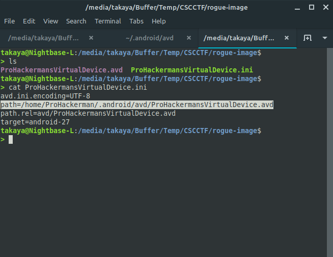
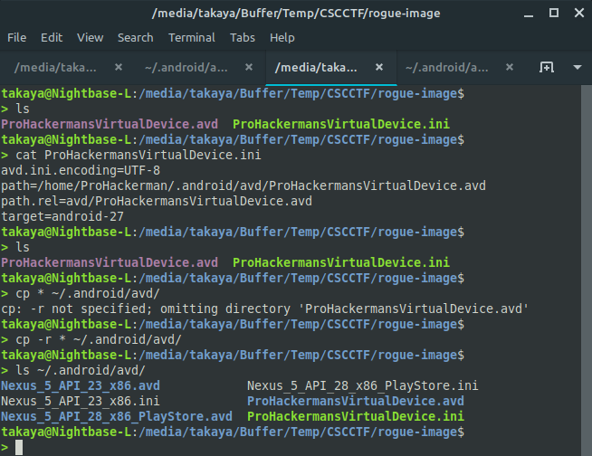
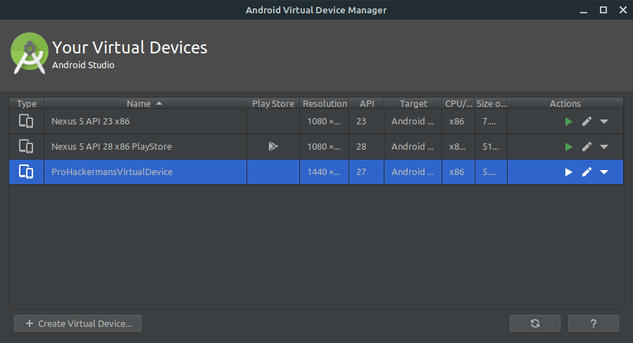
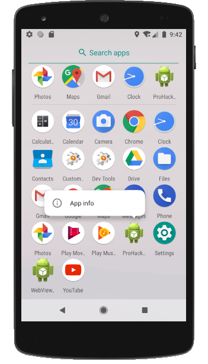
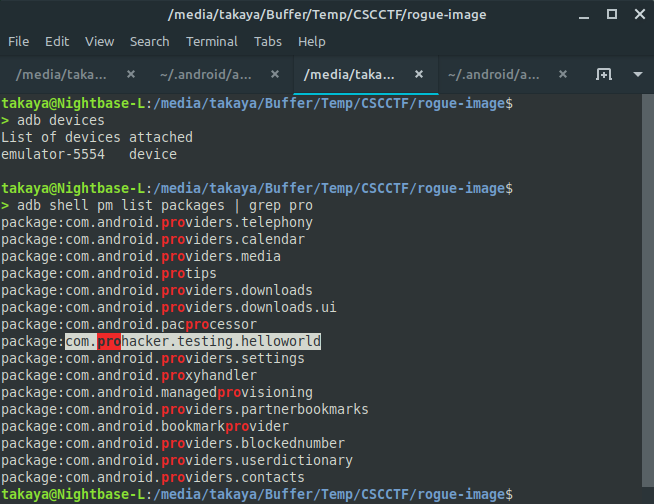
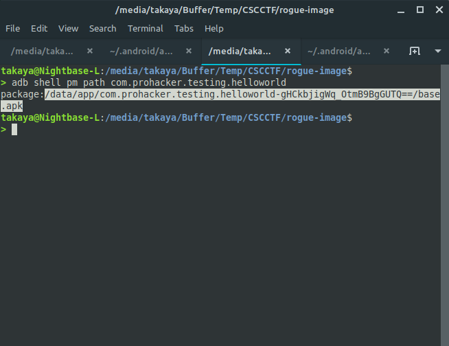
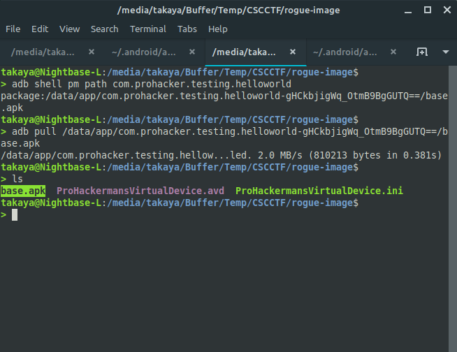
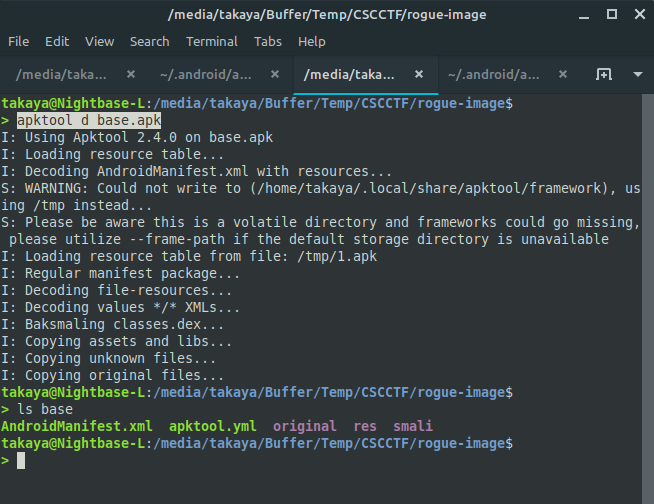
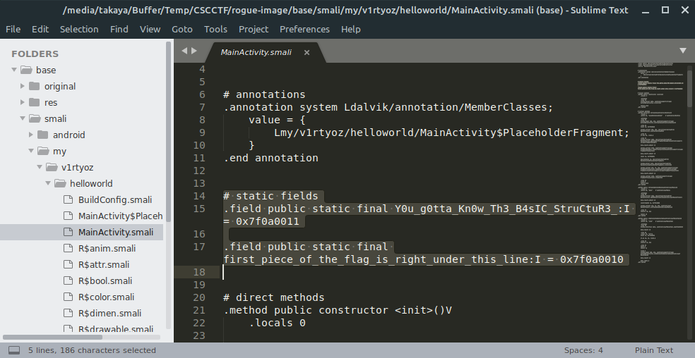
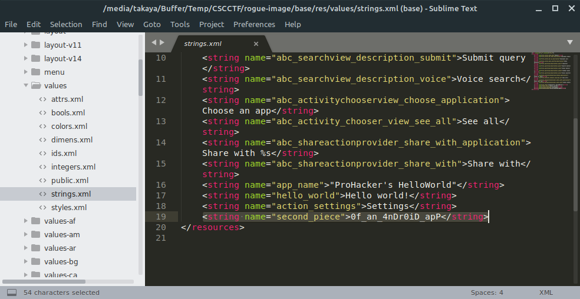

# rogue-image

#### Description

Si Budi Kecil mendapat tautan misterius di surat elektronik miliknya.
Ketika dibuka, Si Budi Kecil menemukan sebuah file rahasia yang dicompress.
 
"Siapapun yang bisa memecahkan misteri yang ada di dalam file ini saya
nyatakan sebagai Master Trainee Android Forensic Analyst/Pentester", begitu pesan yang didapatkan berikut tautan tersebut.
Si Budi Kecil mengupload file tersebut ke dalam [dropbox](https://www.dropbox.com/s/5jza1dsuzms83qt/avd.zip?dl=0).
 
Dapatkah anda menjadi Master Trainee Android Forensic Analyst/Pentester?

#### Writeup
Diberikan dua file dalam satu zip dengan ekstensi `.avd` dan `.ini`. Apabila anda melihat isi dari file `.ini` yang biasanya berisi konfigurasi, anda bisa menebak-nebak bahwa file satunya berkaitan dengan Android. Melihat dari petunjuk di deskripsi dan dibantu _search engine_ favorit anda, maka _AndroidVirtualDevice_ akan dengan mudah masuk ke benak pikiran anda.

 

Setelah mengetahui bahwa file tersebut adalah sebuah _virtual device_ milik **Android Emulator**, anda hanya perlu mencari cara untuk melakukan _restore_.
Anda bisa mencari di Internet bagaimana caranya, atau anda bisa membuat contoh _virtual device_ sendiri dengan _Android Emulator_.

 

Dengan memindahkan kedua file tersebut ke _home directory_ AVD, anda bisa melanjutkan dengan membuka _AVD Manager_.

 

Karena file yang diberikan menggunakan Android API tertentu, anda harus mengunduh file-file yang dibutuhkan. Memang ukurannya tidak kecil, namun seorang _hacker_ wajib memiliki _resourcefulness_ yang gemilang.
 
Ada alasan mengapa umumnya CTF dibuat bertiga (1 _chronicler_, 1 _benefactor_, 1 _hacker_). Apabila anda tidak mampu membeli kuota, carilah anggota tim yang mampu.

Ketika semua berjalan lancar, anda dapat membuka _emulator_ yang telah diimpor barusan dan anda akan menemukan file yang relatif tidak pada tempatnya.

 

Awalnya saya ingin membuat aplikasi yang memungkinkan untuk dikerjakan dua kali, sehingga menghasilkan dua soal. Namun apa daya saya, menjadi pegawai swasta mengurangi waktu saya untuk melakukan penelitian terkait hal yang kurang relevan.

Ada beberapa cara untuk mengambil sebuah aplikasi Android, apalagi ketika anda memiliki _root access_ (seperti pada _emulator_ dalam soal ini). Namun yang akan saya bahas adalah cara tanpa harus mencari file manual dengan _shell_ layaknya mengais-ngais tempat sampah.
 
Pertama, dengan menggunakan `adb` dan `pm` saya mencari dulu aplikasi yang sudah di-_install_ dengan petunjuk seadanya.

 

Kedua, karena adanya [perubahan](https://medium.com/@quaful/the-changes-of-apk-install-location-since-android-oreo-e646d1b53c4d) sejak Android API 26 (Oreo) pada _PackageManager_, saya tidak akan bisa mengambil _base.apk_ hanya dengan mengetahui _package name_ dari suatu aplikasi.
 
Untuk itu saya harus mencari _path_ yang pasti.

 

Dengan ini saya bisa mengambil _base.apk_ dengan `adb pull`.

 

Selanjutnya layaknya _Mobile Application Pentest_ pada umumnya, saya melakukan dekompilasi dengan `apktool` untuk melihat kode Smali aplikasi tersebut. Mungkin sebagian dari kita memulai dengan membaca Java ketimbang Smali terlebih dahulu. Namun tidak jarang aplikasi yang didapat tidak mampu didekompilasi dengan baik, sehingga menurunkan potensi observasi yang seharusnya sangat diutamakan dalam setiap Pentest. Oleh sebab itu, saya membuat soal ini dengan meletakkan _flag_ setelah aplikasi dibuat dengan menggunakan `apktool` untuk dekompilasi dan rekompilasi, bukan ketika membuat aplikasi itu sendiri.

 

_Flag_ terdapat di dua file utama dalam yang perlu diperhatikan dalam setiap pekerjaan yang berkaitan dengan aplikasi Android, yaitu `MainActivity` dan `strings`. Apapun aplikasinya, sejauh ini saya selalu menemukan banyak informasi dari kedua file tersebut, karena apapun yang terjadi, `MainActivity` dan `strings` akan selalu ditemukan.

 

 

Akhir kata, saya mengucapkan terima kasih kepada satu-satunya tim yang berhasil mengerjakan soal ini beberapa menit setelah panitia meminta saya untuk memberikan petunjuk. Alhasil saya tidak perlu melakukan pemeriksaan ulang dan mengorbankan waktu libur saya. Semoga writeup ini dapat bermanfaat.

- takaya

